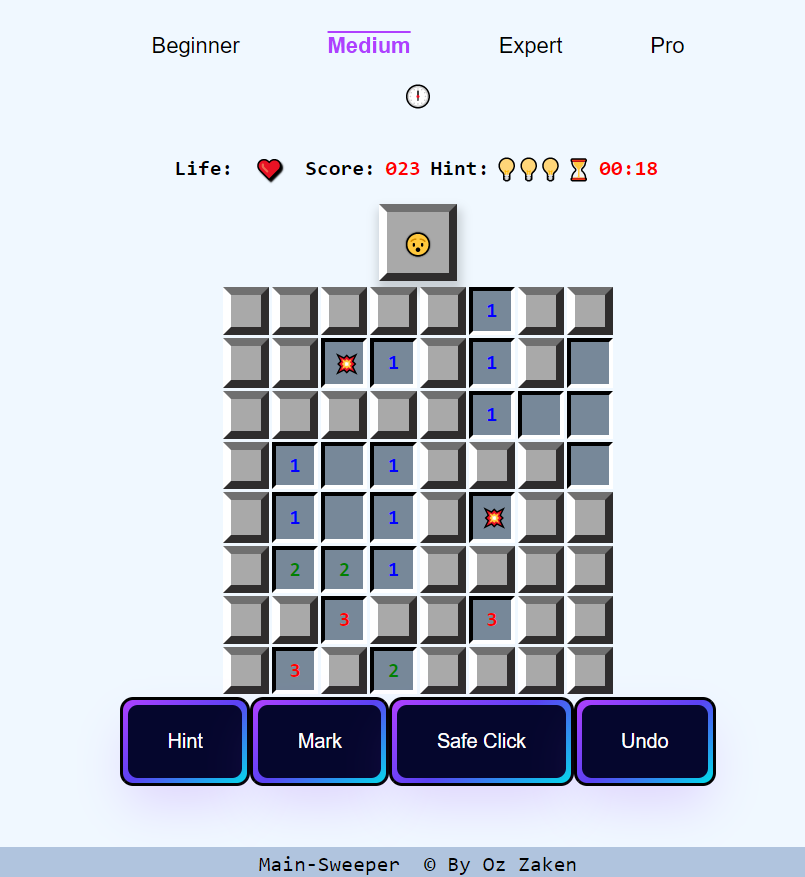

# Minesweeper

The classic game built with vanilla JavaScript.

[Check it Out](https://ozzaken.github.io/minesweeper/)
## How to play
1. Open the index.html file in your browser
2. Choose the difficulty level or set custom number of mines
3. Left click to uncover a cell, right click to place a flag
4. Win by uncovering all cells that do not contain mines
5. Game over if you uncover X cells containing a mine

